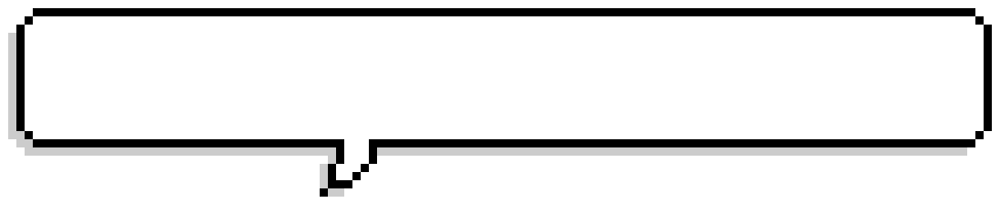

<picture
    align="left">

</picture>

---

## About Me

目前主要以 Laravel & PHP 開發後端網站，偶爾針對 Open Source 套件提出 Pull Request 希望對這個社群能有點貢獻！😆

閒暇之餘也會看看 SOLID & Clean Architecture 讓自身寫程式的品質能夠更好！

## 📚 My Favorite Books

- [無瑕的程式碼－敏捷完整篇－物件導向原則、設計模式與 C#實踐 Agile principles, patterns, and practices in C#](https://www.tenlong.com.tw/products/9789864342099)

## 🖥️ Technologies and Skills

### Frontend

### Backend

### Database & Cache

